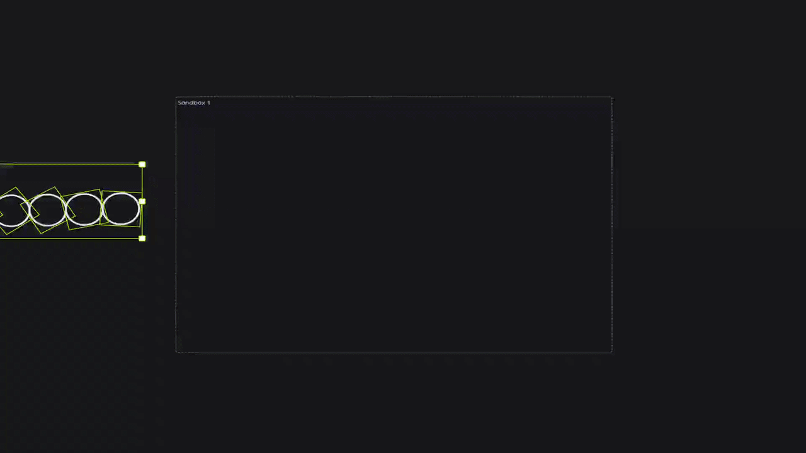

# Physics Engine for drawdy

Drop the shapes on your board into a world with gravity, collisions and friction. Tag what should fall, tag what should hold it up, and let the pile settle — where everything lands is committed back to the board as a single undo step.

## Install

Install the `drawdy-physics-engine.drawdyx` file through drawdy's extensions manager. Once installed, an amber atom icon appears in the side rail.

The extension asks for two permissions the first time it runs: **dom** (for its context menu and panel) and **scene** (to read and move your elements). Denying **scene** leaves the extension inert.

## Step 1: Tag your elements

Select one or more elements, right-click, and choose **Extension → Physics**:

| Tag | What it does | Works on |
| --- | --- | --- |
| **Dynamic** | Falls, collides, bounces, rolls and stacks | Rectangles, circles, diamonds |
| **Static** | Never moves, but everything collides with it | Any element — strokes collide along their drawn path, text as its box |

A ✓ appears next to the tag when the whole selection carries it. Picking the same tag again removes it.

There is no run button. Tagging starts the simulation immediately.

## Step 2: Watch it settle

Dynamic elements fall until everything comes to rest. When the pile is calm for about three quarters of a second, the run ends and the final positions are written to the board as **one undo step** — so a single Cmd/Ctrl+Z puts everything back where it was.

While the simulation runs you can:

- **Drag a body.** It is held in place under your cursor, other bodies collide with it, and it rejoins the simulation when you let go.
- **Move or resize a Static element.** Its collider is rebuilt in place.
- **Paste more tagged shapes.** They drop into the world that is already running.
- **Delete anything.** Its body disappears from the simulation.

Editing or moving a tagged element after a run has settled starts a fresh run.

## The sandbox

The simulation is bounded by a **sandbox**: a dashed rectangle on the board with solid walls on all four sides. It is a real element, so every collaborator sees the same one, and it is not tied to anyone's camera.

The first run creates a sandbox around your tagged content if the board has none. From there:

- **Move, resize or rotate it** with the select tool — the walls follow, even while the simulation is running. Rotate the box and the floor tilts with it.
- **Anything that leaves the sandbox loses its physics tag** automatically, and stays where it landed. This is how you take something out of the simulation: drag it out.
- **Delete it** and any bodies it held are untagged. The next run creates a fresh one.

Boards can hold several sandboxes. An element belongs to whichever one contains it. Keep them apart — overlapping sandboxes share each other's walls, so a body in one will hit the other's invisible wall.

## The panel

Click the atom icon in the side rail to open the panel.

| Section | What you get |
| --- | --- |
| **Sandboxes** | Every sandbox on the board. Set its size, fly to it, or delete it. Double-click a name to rename it — the name shows at the box's top-left corner on the canvas. **+ New** drops another sandbox in the middle of your view. |
| **Static colliders** | Every element tagged Static. |
| **Dynamic bodies** | Every element tagged Dynamic. |

In both element lists, click a row to select that element on the canvas, use **→** to fly to it, or **✕** to remove its physics tag.

## What the simulation does

Semi-implicit Euler integration at a fixed timestep, with an accumulator that keeps time on the wall clock — a busy frame costs smoothness, never simulation speed. Contacts are solved with sequential impulses (restitution plus Coulomb friction), with positional correction to keep bodies from sinking into each other.

Colliders match the shape you tagged: circles are true circles, ellipses become 16-gons, rectangles and diamonds use their rotated outline, and freehand strokes become simplified chains with a two-level bounding-volume index so a long scribble stays cheap to collide against.

Everything runs in the extension's worker, and in-flight motion is drawn as a preview — nothing touches the document until the run settles. Your board stays responsive, and a simulation produces exactly one entry in the undo history and one write for collaborators.

## Troubleshooting

**Nothing falls when I tag something Dynamic.**
Only rectangles, circles and diamonds can be Dynamic. Locked elements are skipped. Check that the element sits inside a sandbox.

**My shapes stopped moving.**
That is the run finishing. Once everything is calm the positions are committed and the simulation goes idle. Move something tagged, or pan the camera, to start it again.

**A shape lost its Physics tag on its own.**
It left the sandbox. Drag it back inside and tag it again.

**Resizing or renaming a sandbox straightened it out.**
Element geometry cannot be changed in place through the extension API, so those actions recreate the rectangle and the rotation resets. Rotate it again afterwards.

**No atom icon in the side rail.**
The extension did not register. Reinstall the `.drawdyx` file.